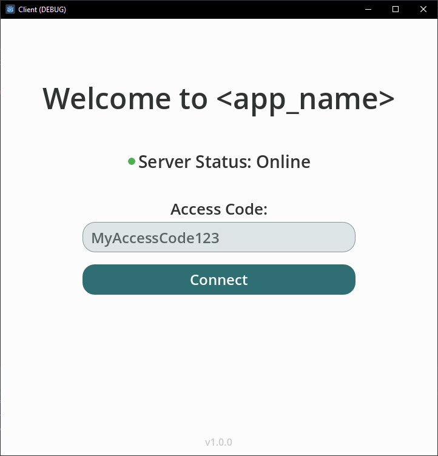
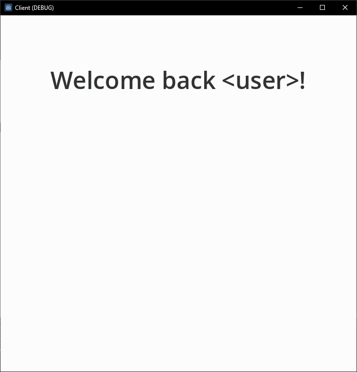
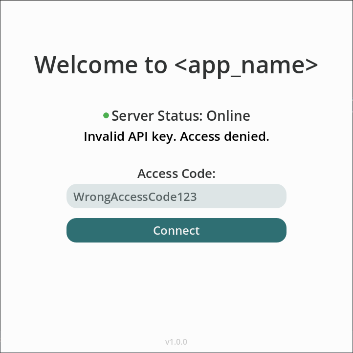
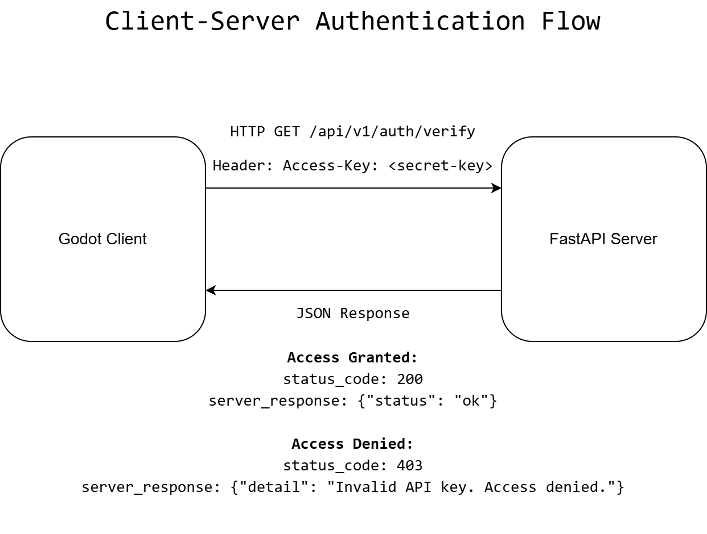

<h1 align="center">Godot-FastAPI Auth Template</h1>

<p align="center">
  <a href="https://godotengine.org/">
    
  </a>
  <a href="https://fastapi.tiangolo.com/">
    
  </a>
  <a href="https://www.gnu.org/licenses/agpl-3.0.en.html">
    
  </a>
</p>

<p align="center">
  A full-stack template featuring a Godot frontend and a Python FastAPI backend. The Godot app provides the user interface and communicates with the backend via HTTP. The backend uses a simple access key authentication system, giving developers control over who can access the app.
</p>

## Table of Contents
- [Table of Contents](#table-of-contents)
- [Overview](#overview)
- [Features](#features)
- [Quick Start](#quick-start)
  - [Initial Configuration](#initial-configuration)
    - [Server Configuration (Environment Variables)](#server-configuration-environment-variables)
    - [Client Configuration](#client-configuration)
  - [Running the project](#running-the-project)
- [How It Works](#how-it-works)
  - [API Endpoints Overview](#api-endpoints-overview)
  - [Communication Flow](#communication-flow)
  - [Authentication](#authentication)
  - [Key Settings](#key-settings)
  - [Server Settings](#server-settings)
  - [Client Settings](#client-settings)
- [Project Structure](#project-structure)
- [License](#license)

## Overview

| Component | Technology | Purpose |
|-----------|------------|---------|
| [Client](client/) | [Godot 4.5](https://godotengine.org/article/maintenance-release-godot-4-5-1/) ([GDScript](https://docs.godotengine.org/en/stable/tutorials/scripting/gdscript/index.html#doc-gdscript)) | User Interface & HTTP requests |
| [Server](server/) | [Python](https://www.python.org/) ([FastAPI](https://fastapi.tiangolo.com/)) | Access key authentication |

**Client (Frontend):** Built with [Godot](https://godotengine.org/) using [GDScript](https://docs.godotengine.org/en/stable/tutorials/scripting/gdscript/index.html#doc-gdscript). The user interface is created using Godot's [Control Nodes](https://docs.godotengine.org/en/stable/classes/class_control.html), which automatically adjust to different screen sizes. Backend communication is handled through the Godot's [HTTPRequest node](https://docs.godotengine.org/en/stable/classes/class_httprequest.html#class-httprequest). <br><br>
**Server (Backend):** Built with [Python](https://www.python.org/) and [FastAPI](https://fastapi.tiangolo.com/). The backend provides API endpoints with no user interface. FastAPI automatically converts [Pydantic](https://docs.pydantic.dev/latest/) models into JSON responses that the client can parse and use to update the UI.

## Features
- 🔐 **Simple Access Key Authentication** - No complex user management
- 📦 **JSON Responses** - Clean, structured API responses
- ⏱️ **Rate Limiting** - Built-in API call limiter and cooldown timer to prevent spam
- 🏗️ **Modular & Scalable API** - Organized with versioning (e.g., `/api/v1/`)
- 📱 **Responsive UI** - Automatically adapts to any screen size
- 🔄 **Dynamic Screen Scaling** - Landscape and portrait mode support 

## Quick Start
1. Clone the repository:
   ```bash
   git clone https://github.com/Vandreic/godot-fastapi-auth-template.git
    ```
2. Install Python dependencies:
   ```bash
    python -m pip install -r server/requirements.txt
    ```
3. Create a `.env` file in the `server/` directory and configure server settings (See [Server Configuration](#server-configuration-environment-variables) below). 
   * Make sure to set a private `GLOBAL_ACCESS_KEY` and ensure `HOST` and `PORT` match the client configuration.
4. Start the server:
   ```bash
    cd server
    set PYTHONPATH=%CD%
    python -m uvicorn app.main:app --reload
    ```
5. Start the client by importing the `client/` folder in the Godot editor and running the project.
6. Test the application by entering your access key and clicking "Connect". You should see a success screen if the key is valid, or an error message if it's invalid.

**Note:** If you experience connection issues, try disabling any VPNs as they may interfere with local server connections.

## Installing / Getting started

### Prerequisites
- [Godot 4.6.1](https://godotengine.org/article/maintenance-release-godot-4-6-1/)
- [Python 3.14.2](https://www.python.org/downloads/release/python-3142/)

Download the repository.

Install Python dependencies:
```bash
python -m pip install -r server/requirements.txt
```

### Initial Configuration

#### Server Configuration (Environment Variables)

Create a `.env` file in the `server/` directory and add the following variables:

```python
# Security - Required
GLOBAL_ACCESS_KEY = "secret-access-key"

# API Configuration
TITLE = "Server API"
DESCRIPTION = "A backend API for the Godot-FastAPI Auth Stack, built with FastAPI."
VERSION = "0.0.1"

# Server Configuration
HOST = "localhost"
PORT = 8000
DEBUG = false
```

**Important:** Replace `secret-access-key` with a private key. Ensure `HOST` and `PORT` match the client configuration. Do not commit `.env` to version control. It should be in `.gitignore`. 

#### Client Configuration

Edit [client/autoload/api_manager.gd](client/autoload/api_manager.gd) and set `HOST` and `PORT` to match the server configuration. The `HOST` must include the protocol:
```gdscript
## The server's host address including the protocol.
const HOST: String = "http://localhost"

## The server's port number.
const PORT: int = 8000
```

### Running the project

1. **Start the Server:**
   ```bash
   cd server
   set PYTHONPATH=%CD%
   python -m uvicorn app.main:app --reload
   ```
   Server runs at `http://localhost:8000`.

2. **Start the Client:**
   - Import `/client` folder in the Godot editor.
   - Run the project (F5).

3. **Test the Application:**
   - Enter your access code and click "Connect".
      <div align="left">
        
      </div>
   - Valid key → success screen:
      <div align="left">
        
      </div>
   - Invalid key → error message:
      <div align="left">
        
      </div>

**Note:** VPN may interfere with local server connections. If you experience connection issues, try disabling the VPN and try again.

## How It Works



**Note:** The diagram illustrates the authenticated request flow for `/api/v1/auth/verify` endpoint.

### API Endpoints Overview

There are two main endpoints for communicating with the API:

| Endpoint                  | Method | Description                  | Auth Required | Success Code | Error Code(s) |
|---------------------------|--------|------------------------------|---------------|--------------|---------------|
| `/api/v1/system/health`   | GET    | Check if server is running   | No            | 200 OK       | 503 Service Unavailable |
| `/api/v1/auth/verify`     | GET    | Verify access key is valid   | Yes           | 200 OK       | 403 Forbidden |

**API Versioning:** Endpoints are versioned under `/api/v1/` as a best practice. This allows new features or breaking changes in future versions (e.g., `/api/v2/`) without affecting existing clients.

- **`/api/v1/system/health`**: Checks server availability. No authentication required. Always verify this endpoint before making authenticated requests.

  - **Example Request:**
    ```http
    GET /api/v1/system/health
    Content-Type: application/json
    ```
  - **Example Response:**
    ```json
    {"status": "ok"}
    ```

- **`/api/v1/auth/verify`**: Validates the access key. Requires a valid `Access-Key` header. Use after confirming server health.

  - **Example Request:**
    ```http
    GET /api/v1/auth/verify
    Content-Type: application/json
    Access-Key: MySecretAccessKey123
    ```
  - **Example Response (Success):**
    <br><span style="font-size:75%">Status: <b>200 OK</b></span>
    ```json
    {
      "status": "ok",
      "role": "user"
    }
    ```

  - **Example Response (Failure: Empty or missing API key):**
    <br><span style="font-size:75%">Status: <b>403 Forbidden</b></span>
    ```json
    {
      "detail": "API key missing. Please provide an 'Access-Key' header."
    }
    ```
  
  - **Example Response (Failure: Invalid API key):**
    <br><span style="font-size:75%">Status: <b>403 Forbidden</b></span>
    ```json
    {
      "detail": "Invalid API key. Access denied."
    }
    ```

**Note:** Always check `/api/v1/system/health` before using `/api/v1/auth/verify` to ensure the server is available.

### Communication Flow

1. **Client** first sends a request to `/api/v1/system/health` to check if the server is online and available.
2. If the server is healthy, **Client** proceeds to send authenticated requests to the `/api/v1/auth/verify` endpoint using Godot's `HTTPRequest` node. For more information about using HTTP requests in Godot, see the [official Godot documentation](https://docs.godotengine.org/en/stable/tutorials/networking/http_request_class.html).
3. **Server** receives requests and, for authenticated endpoints, validates the `Access-Key` header.
4. **Server** returns clear JSON responses.
5. **Client** parses the JSON and updates the UI.

### Authentication

The server uses access key authentication for protected endpoints:

1. **Server** stores the key in `GLOBAL_ACCESS_KEY` environment variable
   - Local development: `.env` file (Never commit! Add to `.gitignore`)
   - Production: managed by hosting platform

2. **Client** sends the key via `Access-Key` header:
   ```http
   Access-Key: MySecretAccessKey123
   ```

3. **Server** validates the key:
   - Valid → HTTP 200 OK with response
   - Invalid → HTTP 403 Forbidden with error message

### Key Settings

| Setting | Where It's Set | Purpose |
|---------|---|----------|
| `HOST` | Server: `.env` <br> Client: `api_manager.gd` | Server address (client includes protocol: `http://localhost`) |
| `PORT` | Server: `.env` <br> Client: `api_manager.gd` | Server port (must match on both sides) |

Must be **identical on server and client** for communication to work.

### Server Settings

Configure these in `server/.env`:

| Variable | Purpose | Default |
|----------|---------|---------|
| `GLOBAL_ACCESS_KEY` | Secret key for API authentication | N/A (required) |
| `HOST` | Server host address | `localhost` |
| `PORT` | Server port | `8000` |

See [server/README.md](server/) for all available server settings.

### Client Settings

Configure these in `client/autoload/api_manager.gd`:

| Variable | Purpose | Default |
|----------|---------|---------|
| `HOST` | Server address (protocol included) | `http://localhost` |
| `PORT` | Server port | `8000` |

See [client/README.md](client/) and [client/autoload/api_manager.gd](client/autoload/api_manager.gd) for all available client settings.

## Project Structure
**Directory Overview:**
- The `client/` folder contains the entire Godot frontend application. All client-related code, UI scenes, scripts, and assets are located here.
- The `server/` folder contains the entire FastAPI backend application. All server-related code, API routes, configuration, and dependencies are located here.

```
godot-python-stack/
├── client/                                         # Godot frontend (Client)
│   ├── icon.svg                                    # Godot Project icon
│   ├── main.gd                                     # Main entry script
│   ├── main.tscn                                   # Main scene
│   ├── project.godot                               # Godot project config
│   │
│   ├── assets/                                     # Assets for UI
│   │   ├── icons/                                  # SVG icons
│   │   │   ├── circle.svg                          # Circle icon
│   │   │   └── sync.svg                            # Sync icon
│   │   │
│   │   └── themes/                                 # UI themes
│   │       └── light_theme.tres                    # Light theme resource (default theme)
│   │
│   ├── autoload/                                   # Global singleton scripts
│   │   ├── api_manager.gd                          # Handles API requests
│   │   └── screen_manager.gd                       # Handles screen transitions
│   │
│   └── screens/                                    # UI screens
│       ├── home/
│       │   ├── home_screen.tscn                    # Home screen scene
│       │   └── home_screen_manager.gd              # Home screen logic
│       │
│       ├── login/
│       │   ├── login_screen.tscn                   # Login screen scene
│       │   └── login_screen_manager.gd             # Login screen logic
│       │
│       └── templates/
│           ├── base_screen_template.tscn           # Base screen template scene
│           └── base_screen_template_manager.gd     # Base screen template logic
│
└── server/                                         # FastAPI backend (Server)
  ├── .env                                          # Environment variables for local development
  ├── requirements.in                               # Python dependency input
  ├── requirements.txt                              # Python dependencies
  │
  └── app/
    ├── main.py                                     # FastAPI app entry point
    │
    ├── api/                                        # API routes and schemas
    │   ├── __init__.py                             # API package init
    │   │
    │   ├── schemas/
    │   │   ├── access.py                           # Access key response schema
    │   │   ├── health.py                           # Health check response schema
    │   │   └── __init__.py                         # Schemas package init
    │   │
    │   └── v1/
    │       ├── __init__.py                         # v1 package init
    │       │
    │       └── routers/                            # v1 API routers
    │           ├── auth.py                         # /auth/verify endpoint
    │           ├── system.py                       # /system/health endpoint
    │           └── __init__.py                     # Routers package init
    │
    └── core/                                       # Core config and security
      ├── config.py                                 # Application configuration
      ├── security.py                               # Access key validation logic
      └── __init__.py                               # Core package init
```

## License
Godot-FastAPI Auth Template is released under the [GNU Affero General Public License v3.0 (AGPL-3.0-only)](LICENSE.md).