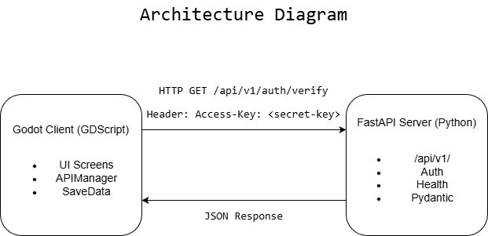
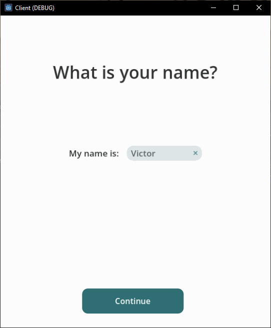

<h1 align="center">Godot-FastAPI Auth Template</h1>

<p align="center">
  <a href="https://godotengine.org/">
    
  </a>
  <a href="https://www.python.org/">
    
  </a>
  <a href="https://fastapi.tiangolo.com/">
    
  </a>
  <a href="https://www.gnu.org/licenses/agpl-3.0.en.html">
    
  </a>
</p>

<p align="center">
  A full-stack template built with a Godot frontend and a Python FastAPI backend. The Godot app provides the user interface and communicates with the backend over HTTP. The backend includes a simple access key verification system: users submit a key, and the server validates it against a static value stored in environment variables.
</p>

## Table of Contents
- [Table of Contents](#table-of-contents)
- [Overview](#overview)
- [Features](#features)
- [Architecture](#architecture)
- [Prerequisites](#prerequisites)
- [Quick Start](#quick-start)
    - [Client Configuration](#client-configuration)
  - [Running the project](#running-the-project)
  - [Testing: IDE vs Phone](#testing-ide-vs-phone)
- [User Flow](#user-flow)
- [How It Works](#how-it-works)
  - [API Endpoints Overview](#api-endpoints-overview)
  - [Communication Flow](#communication-flow)
  - [Authentication](#authentication)
  - [Key Settings](#key-settings)
  - [Server Settings](#server-settings)
  - [Client Settings](#client-settings)
- [Project Structure](#project-structure)
- [Production Considerations](#production-considerations)
- [Credits](#credits)
- [License](#license)

## Overview

| Component | Technology | Purpose |
|-----------|------------|---------|
| [Client](client/) | [Godot 4.6](https://godotengine.org/) ([GDScript](https://docs.godotengine.org/en/stable/tutorials/scripting/gdscript/index.html#doc-gdscript)) | User Interface & HTTP requests |
| [Server](server/) | [Python](https://www.python.org/) ([FastAPI](https://fastapi.tiangolo.com/)) | Access key authentication |

**Client (Frontend):** Built with [Godot](https://godotengine.org/) using [GDScript](https://docs.godotengine.org/en/stable/tutorials/scripting/gdscript/index.html#doc-gdscript). The user interface is created using Godot's [Control Nodes](https://docs.godotengine.org/en/stable/classes/class_control.html), which automatically adjust to different screen sizes. Backend communication is handled through the Godot's [HTTPRequest node](https://docs.godotengine.org/en/stable/classes/class_httprequest.html#class-httprequest). <br><br>
**Server (Backend):** Built with [Python](https://www.python.org/) and [FastAPI](https://fastapi.tiangolo.com/). The backend provides API endpoints with no user interface. FastAPI automatically converts [Pydantic](https://docs.pydantic.dev/latest/) models into JSON responses that the client can parse and use to update the UI.

## Features
- 🔐 **Simple Access Key Authentication** – No complex user management
- 📦 **JSON Responses** – Clean, structured API responses
- ⏱️ **Rate Limiting** – Built-in API call limiter and cooldown timer to prevent spam
- 🏗️ **Modular & Scalable API** – Organized with versioning (e.g., `/api/v1/`)
- 📱 **Responsive UI** – Automatically adapts to any screen size
- 🔄 **Dynamic Screen Scaling** – Landscape and portrait mode support
- 🌍 **Localization (CSV)** – Translation system is set up; add more languages by extending the CSV

## Architecture



The client sends HTTP requests with an `Access-Key` header. The server validates the key against `GLOBAL_ACCESS_KEY` and returns JSON. No session cookies—each protected request includes the key.

## Prerequisites

Before you begin, ensure you have:

- [ ] **[Godot 4.6](https://godotengine.org/download/)** (or compatible 4.x) installed
- [ ] **[Python 3.10+](https://www.python.org/downloads/)** installed
- [ ] **Server running** when testing the client (see [Quick Start](#quick-start))

## Quick Start
1. Clone the repository:
   ```bash
   git clone https://github.com/Vandreic/godot-fastapi-auth-template.git
    ```
2. Install Python dependencies:
   ```bash
    python -m pip install -r server/requirements.txt
    ```
3. Create a `.env` file in the `server/` directory and configure server settings (See [Server Configuration](#server-configuration-environment-variables) below). Set a private `GLOBAL_ACCESS_KEY`, use the same `PORT` as the client (e.g. `8000`), and use `HOST=0.0.0.0` if you plan to test from another device (e.g. phone).
4. Start the server:
   ```bash
    cd server
    python -m app.main
    ```
5. Start the client by importing the `client/` folder in the Godot editor and running the project.
6. Test the application by entering your access key and clicking "Connect". A valid key takes you to the **Name Entry** screen, then the **Home** screen. An invalid key shows an error message.

**Note:** If you experience connection issues, try disabling any VPNs as they may interfere with local server connections.

### Initial Configuration

#### Server Configuration (Environment Variables)

Create a `.env` file in the `server/` directory and add the following variables (use `KEY=value` format, no spaces around `=`). **All variables are required—there are no defaults.** You create the file and must set each one:

```env
# Security - Required
GLOBAL_ACCESS_KEY=secret-access-key

# API Configuration
TITLE=Server API
DESCRIPTION=A backend API for the Godot-FastAPI Auth Stack, built with FastAPI.
VERSION=0.0.1

# Server Configuration
HOST=0.0.0.0
PORT=8000
DEBUG=false
```

**Important:** Replace `secret-access-key` with a strong, private key. Use `HOST=0.0.0.0` to allow connections from your phone on the same network; use `localhost` for local-only. `PORT` must match the client. Do not commit `.env` to version control. It should be in `.gitignore`. 

#### Client Configuration

The client picks the server address automatically based on where it runs:
- **Godot IDE**: Uses `HOST_EDITOR` (localhost). No change needed.
- **Exported app (phone)**: Uses `HOST_EXPORTED`. Set this to your PC's IP address (with protocol, e.g. `http://10.0.0.7`).

**How to get your PC's IP:**
- **Windows:** Open CMD, run `ipconfig`. Look for **IPv4 Address** under your WiFi or Ethernet adapter (e.g. `10.0.0.7` or `192.168.1.100`).
- **macOS/Linux:** Run `ifconfig` or `ip addr`. Look for the IPv4 address on your active adapter.

Edit [client/autoload/api_manager.gd](client/autoload/api_manager.gd):
```gdscript
## For exported app (e.g. phone). Replace with your PC's IP.
const HOST_EXPORTED: String = "http://10.0.0.7"

## Must match server/.env PORT
const PORT: int = 8000
```

### Running the project

1. **Start the Server:**
   ```bash
   cd server
   python -m app.main
   ```
   Server runs at `http://localhost:8000` (or your configured HOST:PORT from `.env`).

2. **Start the Client:**
   - Import `/client` folder in the Godot editor.
   - Run the project (F5).

3. **Test the Application:**
   - Enter your access key and click "Connect".
   - **Valid key** → Name Entry screen → Home screen.
   - **Invalid key** → Error message.

   <p align="center">
     
     
   </p>
   <p align="center">
     
     
   </p>

### Testing: IDE vs Phone

The client automatically uses the right server address:

| Where you run the app | Server address used |
|-----------------------|---------------------|
| Godot IDE (F5)        | `localhost`         |
| Exported app (e.g. phone) | Your PC's IP   |

**IDE testing:**
1. Server `.env`: `HOST=localhost` or `HOST=0.0.0.0`, `PORT=8000`
2. Run server: `cd server` then `python -m app.main`
3. Run Godot project (F5). Client uses `localhost` automatically.

**Phone testing:**
1. Server `.env`: `HOST=0.0.0.0`, `PORT=8000` (required so server accepts network connections)
2. Get your PC's IP: Windows CMD → `ipconfig` → IPv4 under WiFi/Ethernet (e.g. `10.0.0.7`)
3. In [client/autoload/api_manager.gd](client/autoload/api_manager.gd), set `HOST_EXPORTED = "http://YOUR_PC_IP"` (e.g. `http://10.0.0.7`)
4. PC and phone must be on the same WiFi
5. (Optional) Windows Firewall: if the phone cannot connect, allow inbound TCP on port 8000
6. Export the app to your phone and run it

**Note:** VPN may interfere with local server connections. Disable it if you experience connection issues.

## User Flow

The app follows this screen flow:

1. **Language Selection** — User picks a language (first launch only).
2. **Login** — User enters the access key and clicks "Connect".
3. **Name Entry** — After successful verification, user enters their name.
4. **Home** — Main screen after completing the flow.

On subsequent launches, if language and name are already saved, the app goes directly to the appropriate screen (e.g. Home if both are set).

## How It Works


### API Endpoints Overview

There are two main endpoints for communicating with the API:

| Endpoint                  | Method | Description                  | Auth Required | Success Code | Error Code(s) |
|---------------------------|--------|------------------------------|---------------|--------------|---------------|
| `/api/v1/system/health`   | GET    | Check if server is running   | No            | 200 OK       | 503 Service Unavailable |
| `/api/v1/auth/verify`     | GET    | Verify access key is valid   | Yes           | 200 OK       | 403 Forbidden |

**API Versioning:** Endpoints are versioned under `/api/v1/` as a best practice. This allows new features or breaking changes in future versions (e.g., `/api/v2/`) without affecting existing clients.

- **`/api/v1/system/health`**: Checks server availability. No authentication required. Always verify this endpoint before making authenticated requests.

  - **Example Request:**
    ```http
    GET /api/v1/system/health
    Content-Type: application/json
    ```
  - **Example Response:**
    ```json
    {"status": "ok"}
    ```

- **`/api/v1/auth/verify`**: Validates the access key. Requires a valid `Access-Key` header. Use after confirming server health.

  - **Example Request:**
    ```http
    GET /api/v1/auth/verify
    Content-Type: application/json
    Access-Key: MySecretAccessKey123
    ```
  - **Example Response (Success):**
    <br><span style="font-size:75%">Status: <b>200 OK</b></span>
    ```json
    {
      "status": "ok",
      "role": "user"
    }
    ```

  - **Example Response (Failure: Empty or missing API key):**
    <br><span style="font-size:75%">Status: <b>403 Forbidden</b></span>
    ```json
    {
      "detail": "API key missing. Please provide an 'Access-Key' header."
    }
    ```
  
  - **Example Response (Failure: Invalid API key):**
    <br><span style="font-size:75%">Status: <b>403 Forbidden</b></span>
    ```json
    {
      "detail": "Invalid API key. Access denied."
    }
    ```

**Note:** Always check `/api/v1/system/health` before using `/api/v1/auth/verify` to ensure the server is available.

### Communication Flow

1. **Client** first sends a request to `/api/v1/system/health` to check if the server is online and available.
2. If the server is healthy, **Client** proceeds to send authenticated requests to the `/api/v1/auth/verify` endpoint using Godot's `HTTPRequest` node. For more information about using HTTP requests in Godot, see the [official Godot documentation](https://docs.godotengine.org/en/stable/tutorials/networking/http_request_class.html).
3. **Server** receives requests and, for authenticated endpoints, validates the `Access-Key` header.
4. **Server** returns clear JSON responses.
5. **Client** parses the JSON and updates the UI.

### Authentication

The server uses access key authentication for protected endpoints:

1. **Server** stores the key in `GLOBAL_ACCESS_KEY` environment variable
   - Local development: `.env` file (Never commit! Add to `.gitignore`)
   - Production: managed by hosting platform

2. **Client** sends the key via `Access-Key` header:
   ```http
   Access-Key: MySecretAccessKey123
   ```

3. **Server** validates the key:
   - Valid → HTTP 200 OK with response
   - Invalid → HTTP 403 Forbidden with error message

### Key Settings

| Setting | Where It's Set | Purpose |
|---------|---|----------|
| Host | Server: `.env` <br> Client: `api_manager.gd` | Server address. Client uses `localhost` in IDE, `HOST_EXPORTED` when exported (e.g. phone). |
| `PORT` | Server: `.env` <br> Client: `api_manager.gd` | Server port (must match on both sides) |

`PORT` must be **identical on server and client** for communication to work.

### Server Settings

Configure these in `server/.env`. **All variables are required—there are no defaults.** You create the file and must set each one:

| Variable | Purpose | Example |
|----------|---------|---------|
| `GLOBAL_ACCESS_KEY` | Secret key for API authentication | `your-secret-key` |
| `TITLE` | API title (shown in docs) | `Server API` |
| `DESCRIPTION` | API description | `A backend API for the Godot-FastAPI Auth Stack, built with FastAPI.` |
| `VERSION` | API version | `0.0.1` |
| `HOST` | Server host. Use `0.0.0.0` for phone testing. | `0.0.0.0` |
| `PORT` | Server port (must match client) | `8000` |
| `DEBUG` | Enable auto-reload and debug mode | `false` |

See [server/README.md](server/README.md) for all available server settings.

### Client Settings

Configure these in `client/autoload/api_manager.gd`:

| Variable | Purpose | Default |
|----------|---------|---------|
| `HOST_EDITOR` | Used when running from Godot IDE | `http://localhost` |
| `HOST_EXPORTED` | Used when app runs outside editor (e.g. phone). Set to your PC's IP. | `http://10.0.0.7` |
| `PORT` | Server port (must match `server/.env`) | `8000` |

See [client/README.md](client/README.md) and [client/autoload/api_manager.gd](client/autoload/api_manager.gd) for all available client settings.

## Project Structure

**Directory Overview:**
- The `client/` folder contains the entire Godot frontend application. All client-related code, UI scenes, scripts, and assets are located here.
- The `server/` folder contains the entire FastAPI backend application. All server-related code, API routes, configuration, and dependencies are located here.

```
godot-fastapi-auth-template/
├── client/                                         # Godot frontend (Client)
│   ├── icon.svg                                    # Godot Project icon
│   ├── main.gd                                     # Main entry script
│   ├── main.tscn                                   # Main scene
│   ├── project.godot                               # Godot project config
│   │
│   ├── assets/                                     # Assets for UI
│   │   ├── icons/                                  # SVG icons
│   │   │   ├── circle.svg                          # Circle icon
│   │   │   └── sync.svg                            # Sync icon
│   │   │
│   │   ├── localization/                           # CSV translations
│   │   │   └── translations.csv                    # Translation file
│   │   │
│   │   └── themes/                                 # UI themes
│   │       └── light_theme.tres                    # Light theme resource (default theme)
│   │
│   ├── autoload/                                   # Global singleton scripts
│   │   ├── api_manager.gd                          # Handles API requests
│   │   ├── save_data.gd                            # Persists name, language, cooldown
│   │   └── screen_manager.gd                       # Handles screen transitions
│   │
│   ├── utilities/
│   │   └── file_handler.gd                         # File I/O for save data
│   │
│   └── screens/                                    # UI screens
│       ├── home/
│       │   ├── home_screen.tscn                    # Home screen scene
│       │   └── home_screen_manager.gd              # Home screen logic
│       │
│       ├── language_selection/
│       │   ├── language_selection_screen.tscn     # Language picker
│       │   └── language_selection_manager.gd       # Language selection logic
│       │
│       ├── login/
│       │   ├── login_screen.tscn                   # Access key input
│       │   └── login_screen_manager.gd             # Login logic
│       │
│       ├── name_entry/
│       │   ├── name_entry_screen.tscn              # Name input (after login)
│       │   └── name_entry_screen_manager.gd        # Name entry logic
│       │
│       └── templates/
│           ├── base_screen_template.tscn           # Base screen template scene
│           └── base_screen_template_manager.gd     # Base screen template logic
│
└── server/                                         # FastAPI backend (Server)
  ├── .env                                          # Environment variables for local development
  ├── requirements.in                               # Python dependency input
  ├── requirements.txt                              # Python dependencies
  │
  └── app/
    ├── main.py                                     # FastAPI app entry point
    │
    ├── api/                                        # API routes and schemas
    │   ├── __init__.py                             # API package init
    │   │
    │   ├── schemas/
    │   │   ├── access.py                           # Access key response schema
    │   │   ├── health.py                           # Health check response schema
    │   │   └── __init__.py                         # Schemas package init
    │   │
    │   └── v1/
    │       ├── __init__.py                         # v1 package init
    │       │
    │       └── routers/                            # v1 API routers
    │           ├── auth.py                         # /auth/verify endpoint
    │           ├── system.py                       # /system/health endpoint
    │           └── __init__.py                     # Routers package init
    │
    └── core/                                       # Core config and security
      ├── config.py                                 # Application configuration
      ├── security.py                               # Access key validation logic
      └── __init__.py                               # Core package init
```

## Production Considerations

This template is designed as a simple, secure starting point. If you deploy to production:

- **Restrict CORS** — Change `allow_origins=["*"]` in `server/app/main.py` to your client's domain(s).
- **Use HTTPS** — Serve the API over HTTPS; the client should use `https://` for `HOST_EXPORTED` and `HOST_EDITOR` when applicable.
- **Strong access key** — Use a long, random value for `GLOBAL_ACCESS_KEY`. Do not commit `.env`.
- **Environment variables** — Store secrets in your host's environment, not in code.

## Credits
| Asset | Source | License |
| :--- | :--- | :--- |
| **Country Flags** | [lipis/flag-icons](https://github.com/lipis/flag-icons) | MIT |
| **Icons** | [Google Material Icons](https://fonts.google.com/icons) | Apache 2.0 |

## License
Godot-FastAPI Auth Template is released under the [GNU Affero General Public License v3.0 (AGPL-3.0-only)](LICENSE.md).